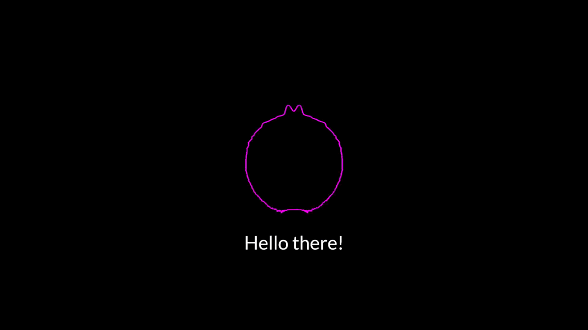

<h1 align="center">Kara</h1>
<h2 align="center">
  A <em style="color: #0099ff">crossplatform</em>, wgpu digital assistant!
</h2>
<h3 align="center">In early development</h3>

  
  
  

<h1 align="center"></h1>

  

# Build Dependencies

1. [`cargo-make`](https://github.com/sagiegurari/cargo-make)

# Setting up

1. Clone the repository:

   `git clone https://github.com/kawaki-san/kara-assistant`

2. Build the project with
   [`cargo-make`](https://github.com/sagiegurari/cargo-make):

   `cargo make build`
