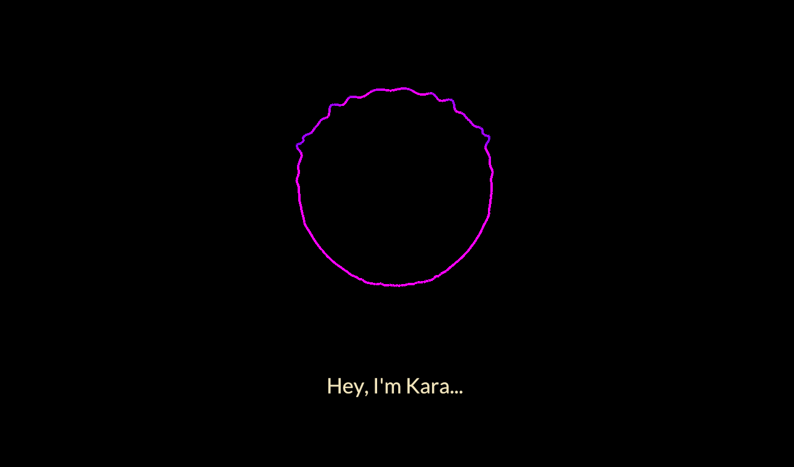

<h1 align="center">Kara</h1>
<h2 align="center">A <em style="color: #0099ff">crossplatform</em>, WebGPU digital assistant!</h2>
<h3 align="center">In early development</h3>

    
    

<h1 align="center"></h1>

